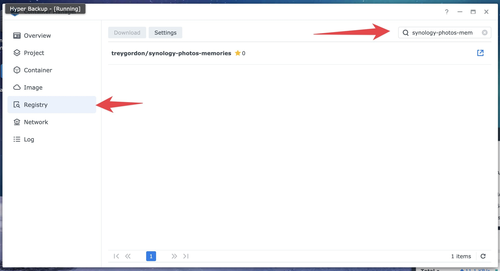
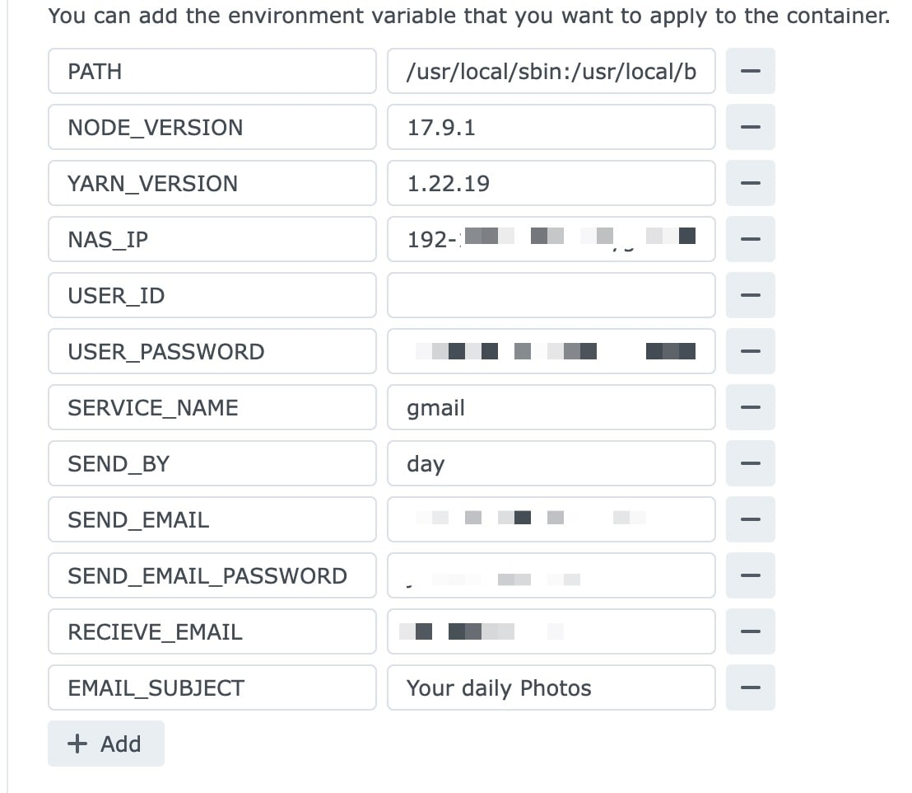

# Synology Photos Memories

This is a Node JS/Docker app that fills the void for synology photos lacking a memory feature similar to Google Photos. The simple solution that I've found is to use the [unofficial api](https://github.com/zeichensatz/SynologyPhotosAPI) to fetch the photos in a given timeframe, and send an email with working web links to those photos. Furthermore, NodeJS serves a web page where these photos can be accessed.

## Hosting on your NAS

The easiest way to use this app would be to host it on your NAS using Docker

### DSM 7.2+

> **Important**
> If you have not set up quickconnect, you should (as admin) go in Control Panel -> Login Portal -> Applications and set the `photo` alias related to Synology Photos app.

To install with Docker using the new container manager app, use the following steps:

1. Search for, and download the the image from the Docker registry. Select the latest tag
   
2. Go to the image and click run
3. Change the container name if you prefer, and click next
4. In the `Port Settings` section, click Add and set the `Local Port` (the first textfield input) to whatever you want: it's the port you will use to access the web view of 'memories'; Then set the `Container Port` (the second textfield input) to `8080`
5. Add the following ENV variables

#### Docker config

You'll need the following environment variables to run the image:

| Key                 | Value                                                    | Optional |
| ------------------- | -------------------------------------------------------- | -------- |
| NAS_IP              | yournasip.yourquickconnectid.direct.quickconnect.to:5001 | No       |
| USER_ID             | MyID                                                     | No       |
| USER_PASSWORD       | password123                                              | No       |
| SERVICE_NAME        | gmail                                                    | No       |
| SEND_BY             | month                                                    | No       |
| SEND_EMAIL          | emailtosendfrom@gmail.com                                | No       |
| SEND_EMAIL_PASSWORD | sendpassword123                                          | No       |
| RECEIVE_EMAIL       | receiveemail@proton.me                                   | No       |
| EMAIL_SUBJECT       | Your Monthly Photos                                      | Yes       |
| PORT                | Your Monthly Photos in web page ( [NB](#port) )          | No       |
| FOTO_TEAM           | Optional value for foto space. Set to `true` if  you only have photos in shared space not in your personal space        | Yes      |

You shouldn't need to change any other settings.

#### NAS_IP:

This is the url you use to connect to quickconnect. Used to build the links in each email.

> **Note**
> Email send and webpage view have only been tested with quickconnect enabled, so NAS_IP should point to your quickconnect url. Other's have suggested it works the same with `http:<yourlocalport>:5001`

#### USER_ID:

This is the ID you use to login to quickconnect

#### USER_PASSWORD:

Your password for quickconnect

#### SERVICE_NAME:

This is the service provider of the email you'll use for your memories to be sent from. Gmail is probably the easiest, but you may need to add an 'app password' to allow access if you have 'allow less secure apps' enabled in your settings.

You can do so at myaccount.google.com/apppasswords

Here's a list of the following services that are allowed for your send email: https://community.nodemailer.com/2-0-0-beta/setup-smtp/well-known-services/

#### SEND_BY:

This is how frequently you want a memory email. The options are 'day', 'week', or 'month'. For 'day', the email will be sent every morning at 8am. For 'week', the email will be sent every Monday at 8am. for 'month', it will be sent the first of every month at 8am.

#### SEND_EMAIL:

This is the email address from the same service provider you selected earlier, from which your memory emails will be sent.

#### SEND_EMAIL_PASSWORD:

The password for your send email (may require 'app password' for gmail). If you have enabled 2-factor authentication you need to generate an app-specific password and use that in place of your actual password.To do that, go to [My App Passwords](https://myaccount.google.com/apppasswords).

#### RECEIVE_EMAIL:

The email address you want the memory emails delivered to. This can be any email address/service.

#### EMAIL_SUBJECT:

This can be anything you want.

#### PORT:

> **Important**
> This must be the same port as the `Local Port` set in the [Port Settings section](#dsm-72).

This can be any port you want (not already in use). The web page is then accessible through it.

### FOTO_TEAM
Optional boolean value in case you only have photos in your shared space. 

---

Altogether, your env settings should look something like this:

6. Click done

---

Feel free to make a pull request or submit an issue if you see any mistakes!
